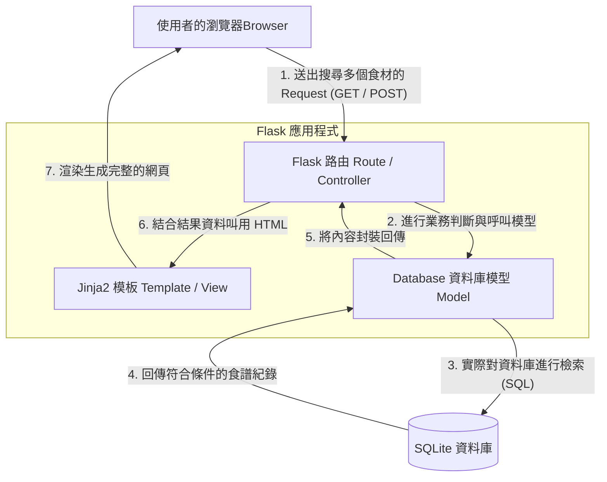

# 系統架構設計文件 (ARCHITECTURE) - 食譜收藏夾系統

## 1. 技術架構說明

本系統基於 Python 的 **Flask** 框架進行開發，並採用伺服器端渲染 (Server-Side Rendering, SSR) 的方式，讓所有的頁面產製與核心邏輯皆在後端統一處理與產出。
*   **後端框架 (Flask)**：輕量、具有高擴展性，能快速搭建應用程式，非常適合開發中小型 Web 專案。
*   **視圖模板 (Jinja2)**：與 Flask 緊密整合的模板語言。負責把後端處理好的資料庫內容，動態結合 HTML 直接發送給瀏覽器。因此，不需要建立複雜的前後端分離 API，大幅降低開發初期的時間成本。
*   **資料庫 (SQLite)**：以檔案的輕量級格式來儲存關聯式資料，符合 MVP（最小可行性產品）階段的需求，本地端開發、備份皆非常簡單。
*   **前端設計 (Vanilla CSS + JS)**：不依賴如 React 或 Vue 的大型框架。透過手寫 CSS 處理介面外觀，並用基本的 JavaScript 強化前端操作體驗（如按鈕互動、表單基本檢查）。

### Flask MVC 對應模式
本專案在實作切分上，遵循 MVC (Model-View-Controller) 架構精神：
*   **Model (模型)**：負責定義資料的結構與欄位，以及與資料庫直接進行讀寫操作（包括：使用者資料表、食譜資料表、與多對多的食材關聯）。對應專案的 `models/` 目錄。
*   **View (視圖)**：負責呈現給使用者操作、閱讀的視覺介面。在此專案中對應到 `templates/` 目錄內的 `.html` 檔案 (透過 Jinja2 渲染)。
*   **Controller (控制器)**：負責接收外界網頁發送的 HTTP Request (如點擊搜尋、送出表單)，再透過呼叫 Model 層來處理資料，接著傳遞回 View 介面。對應專案中各個 `routes/` 檔案內的 API 與路由 (@app.route)。

---

## 2. 專案資料夾結構

為保持程式碼的條理分明與後續容易延伸，我們設計以下資料夾結構：

```text
recipe_app/
│
├── app/                      ← 存放應用程式主體邏輯的目錄
│   ├── __init__.py           ← 初始化 Flask 實體，並在此註冊各種設定與 Blueprints
│   ├── models/               ← 資料庫對應的 Model 內容存放區
│   │   ├── user.py           ← 使用者關聯資料表
│   │   ├── recipe.py         ← 食譜主體、食材清單、多對多關聯等結構
│   │   └── database.py       ← 給 SQLite3 或 SQLAlchemy 共用的連線與管理設定
│   ├── routes/               ← Flask 各項業務與路由規則 (Controller)
│   │   ├── auth.py           ← 會員註冊、登入登出功能模組
│   │   ├── recipe.py         ← 處理食譜新增、查詢與多條件食材搜尋等模組
│   │   └── admin.py          ← 管理員檢視和下架內容等權限模組
│   ├── templates/            ← Jinja2 網頁模板放置區 (View)
│   │   ├── base.html         ← 全站共用的佈局版型 (導覽列與頁尾)
│   │   ├── auth/             ← 登入、註冊表單等登錄畫面
│   │   ├── recipe/           ← 食譜列表首頁、食譜單一內頁與新增表單
│   │   └── admin/            ← 後台管理專用介面
│   └── static/               ← 靜態資源區（瀏覽器直接抓取的檔案）
│       ├── css/              ← 純手寫 CSS 樣式
│       ├── js/               ← 瀏覽器端用 JavaScript 檔案
│       └── images/           ← 備用的圖片存放區 (含使用者上傳儲存的內容)
│
├── instance/                 ← 不納入 Git 版控，安全層級較高的運行資料擺放區
│   └── database.db           ← SQLite 實體資料庫檔案
│
├── config.py                 ← 程式全域環境變數及安全 Secret Key 設定檔
├── run.py                    ← 整個專案程式啟動點
└── requirements.txt          ← 專案必須要用的 Python 依賴套件表 (Flask 等)
```

---

## 3. 元件關係圖

以下展示專案在執行時，使用者端至後端的處理互動順序：



---

## 4. 關鍵設計決策

以下為為符合 PRD 需求而訂立的重要設計決策方向：

1.  **無前後端分離設計（降低 MVP 開發複雜度）**
    *   **原因**：在此階段 (MVP) 首重驗證商業邏輯與核心功能的實作可行性。採取 Jinja2 進行一體的 HTML 畫面伺服端渲染，團隊可以省去撰寫各種規格嚴謹之 RESTful API 與處理前端狀態庫之門檻，將專注力放在「會員」與「食材搜尋關聯」上。
2.  **安全性全面防堵（密碼防護與過濾不當輸出）**
    *   **原因**：用戶若需註冊個人帳號，不能明文存放密碼，為遵循資訊安全最佳實踐必須導入如 `bcrypt` 來進行不可逆的雜湊加鹽處理。此外，對於 PRD 中要求的表單內容輸入防護，採用 Jinja2 本身內建的強大 Escaping 排版與嚴謹的資料庫預句處理 (Prepared Statements 或 ORM)，可直接免除大量的 SQL Injection 及 XSS 攻擊的威脅。
3.  **多對多食材關聯設計與結構最佳化**
    *   **原因**：核心功能需支援「透過多樣食材篩選食譜」。傳統的單一字串模糊查詢會造成極差的匹配效能。於是我們在資料庫設計端會採取 `食譜(Recipe)` 與 `食材(Ingredient)` 分開建立，中間運用 `Recipe_Ingredient_Map` 對應表的「多對多 (Many-to-Many)」關聯。即使需要擴增幾千筆食材組合查詢，也能順利被 SQLite 單單用優化過的語法執行出來。
4.  **採用 Blueprint 路由模組化功能**
    *   **原因**：因為專案系統裡，明顯區分出了一般使用者認證 (`auth`)、資料核心業務 (`recipe`) 與特殊權限操作 (`admin`) 三條截然不同的線頭。使用 Flask 提供的 `Blueprint` 功能來做架構上的切分，可以降低各路由之間的依賴程度，未來新增需求時不怕會導致整個控制器大亂。
