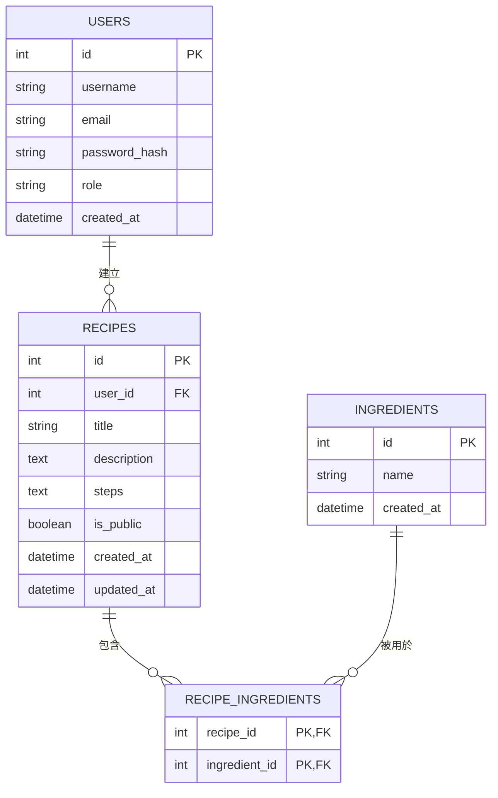

# 資料庫設計文件 (DB_DESIGN) - 食譜收藏夾系統

本文件由 `/db-design` skill 自動產生，根據 PRD 與系統架構文件定義出適合 MVP 版本的 SQLite 關聯式資料庫設計。

## 1. ER 圖（實體關係圖）

## 2. 資料表詳細說明

### 2.1 USERS (使用者表)
儲存使用者的基本帳號與登入資訊。
- `id` (INTEGER): Primary Key，唯一識別碼，自動遞增。
- `username` (TEXT): 必填，使用者自訂名稱。
- `email` (TEXT): 必填，登入用信箱，必須唯一 (UNIQUE)。
- `password_hash` (TEXT): 必填，加密後的密碼安全字串。
- `role` (TEXT): `user` 或 `admin`，預設為 `user`。
- `created_at` (DATETIME): 帳號建立時間，預設目前時間 CURRENT_TIMESTAMP。

### 2.2 RECIPES (食譜表)
記錄食譜的核心內容。
- `id` (INTEGER): Primary Key，唯一識別碼。
- `user_id` (INTEGER): Foreign Key，必填，關聯至 `users.id`，建立此食譜的使用者 ID。
- `title` (TEXT): 必填，食譜名稱。
- `description` (TEXT): 食譜簡介。
- `steps` (TEXT): 必填，製作步驟，可儲存換行文字。
- `is_public` (BOOLEAN): 是否對外公開，1: 公開 / 0: 私有，預設為 1。
- `created_at` (DATETIME): 建立時間，預設 CURRENT_TIMESTAMP。
- `updated_at` (DATETIME): 最後更新時間，預設 CURRENT_TIMESTAMP。

### 2.3 INGREDIENTS (食材表)
全系統共用的食材字典庫。
- `id` (INTEGER): Primary Key，唯一識別碼。
- `name` (TEXT): 必填，必須唯一 (UNIQUE)，食材名稱（例如：蛋、番茄）。
- `created_at` (DATETIME): 建立時間，預設 CURRENT_TIMESTAMP。

### 2.4 RECIPE_INGREDIENTS (食譜食材關聯表，多對多)
處理食譜與食材的「多對多」對應關係。
- `recipe_id` (INTEGER): Foreign Key，關聯至 `recipes.id`。
- `ingredient_id` (INTEGER): Foreign Key，關聯至 `ingredients.id`。
- PK 為 `(recipe_id, ingredient_id)` 的組合鍵。

## 3. SQL 建表語法
完整的建表語法請參考專案中的 `database/schema.sql`，系統將據以建立 SQLite 檔案庫。

## 4. Python Model 實作
依照 MVC 架構，實作檔案儲存於 `app/models/`，使用 `sqlite3` 提供CRUD方法：
- `database.py`: 建立共用資料庫連線及初始化工具。
- `user.py`: 操作 `users` 表的 User 物件。
- `recipe.py`: 操作 `recipes`、`ingredients` 與多對多關聯的 Recipe / Ingredient 物件。
